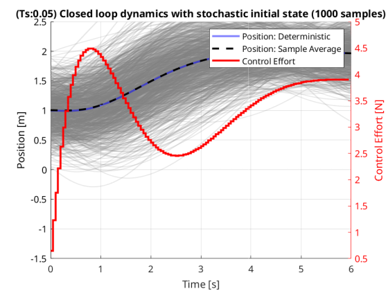

# Multi-fidelity Stochastic Trajectory Optimization

## Overview

- Given the state space equations of a system, we can predict how it evolves over time with a given control input.
- Since we can predict the future states of the system, we can optimize the control inputs over time to make sure the system gets to a desired state (position and vecocity = 0 in this case).
- We also do not want to use too much control effort to get to the desired state.
- Putting both of these ideas into maths, we can construct a cost function that is dependent on how far away the state is to the desired state and how much control effort is being used.
- This function can then be minimized over the control inputs to see which control inputs can get the system to the desired state with minimal effort.
- Now some things in the system might not be known exactly, like the initial state of the system or the spring constant of a mass spring damper system.
- These unknowns can be modeled as random variables, and the cost function then becomes a random variable itself, since it is now a function of other random variables.
- This cost function can be estimated using Monte Carlo with random samples from the distribution of the parameters, which would give us an expected value of the cost function.
- If we use fewer samples in the Monte Carlo, the estimate will be less accurate and will be away from the true expected value of the cost function more often and vice-versa.
- This means that if we were to repeat the Monte Carlo simulation multiple times with a fixed number of samples, it will have some variance in the estimate of the cost function.
- Our goal then becomes to minimize this variance in the Monte Carlo estimate of the cost function given a finite total computational cost, so that every time we run Monte Carlo, we are sure that it wont be too far off from the true value.
- Now normally we would just increase the number of samples in the Monte Carlo to reduce the variance till we hit our computational budget.
- But what if we had access to a lower fidelity model of the system that could give us a rough estimate (maybe it has some bias in either the cost or the solution of control inputs) of the cost function with lower computational cost? This means we can run more samples in the lower fidelity model for the same computational cost!
- With this in mind, our goal of minimizing the variance in the Monte Carlo estimate of the cost function is now not just about maxxing out the number of samples, but finding a good balance between the the number of samples we run in the high and low fidelity models given a fixed total computational budget that minimizes the variance.
- If we have multiple fidelity models, we will have to determine how to distribute the samples among the models.
- So to summarize
  - We have a system, whose trajectory we want to optimize using a cost function
  - Some parameters in the system are random, so the cost function is also random
  - To get an expectation of the cost function, we use Monte Carlo using random samples of the random parameters
  - If we have a low fidelity model as well, we can run a lot of samples in that model or run a few samples in the high fidelity model.
  - We want the Monte Carlo estimate to be close to the true value of the cost function, so we want to minimize its run-to-run variance.
  - Hence we try to distribute the samples among the models for a single run of the Monte Carlo so its variance is minimized.

## Dynamics

For this paper, a simplified trajectory optimization problem is considered for ease of modelling.
The objective is to solve a reference tracking problem for the position and velocity of a simple mass-spring-damper system.
The mass-spring-damper system has the following parameters:

- $m = 5$ g : Mass
- $k = 2$ N/m : Spring constant
- $c = 0.5$ Ns/m : Damping coefficient

Given an external force $F$ and the acceleration of the system $\ddot{x}$,
the dynamics of the system can be written as the equality of forces acting on the mass:

$$
\begin{aligned}
   m\ddot{x} &= F - c\dot{x} - kx \\
   \implies \ddot{x} &= \frac{F}{m} - \frac{c}{m}\dot{x} - \frac{k}{m}x
\end{aligned}
$$

We have the state as $[x \dot{x}]^T$ containing the position and velocity of the mass, both of which are observed.
The control input $u=F$ is applied to the mass, yielding the following state space model:

$$
\begin{aligned}
  \begin{bmatrix}
    \dot{x} \\
    \ddot{x}
  \end{bmatrix} &=
  \begin{bmatrix}
    0 & 1 \\
    -\frac{k}{m}  -\frac{c}{m}
  \end{bmatrix}
  \begin{bmatrix}
    x \\
    \dot{x}
  \end{bmatrix} +
  \begin{bmatrix}
    0 \\
    \frac{1}{m}
  \end{bmatrix} u \\
  y &=
  \begin{bmatrix}
    1 & 0 \\
    0 & 1
  \end{bmatrix}
  \begin{bmatrix}
    x \\
    \dot{x}
  \end{bmatrix}
\end{aligned}
$$

Thus, we have a standard continuous-time LTI system $\dot{x} = A_cx + B_cu$ and $y = C_cx$, where

$$
\begin{aligned}
   A_c &=
   \begin{bmatrix}
   0 & 1 \\
   -\frac{k}{m} & -\frac{c}{m}
   \end{bmatrix} \\
   B_c &=
   \begin{bmatrix}
   0 \\
   \frac{1}{m}
   \end{bmatrix} \\
   C_c &=
   \begin{bmatrix}
   1 & 0 \\
   0 & 1
   \end{bmatrix}
\end{aligned}
$$

## Deterministic LQR

The continuous-time system can be converted to discrete time using such that $x_{k+1} = A x_k + B u_k$ and $y_k = C x_k$ for a chosen sampling time $T_s$.
The $A$ and $B$ matrices for the discrete time system are then used to formulate the cost function for the LQR problem.

We set up an LQR controller to track the reference position and velocity of the mass-spring-damper system.
An LQR controller was chosen because it has a quadratic cost function that can be minimized analytically and gives us a
good reference for the trajectory optimization problem.

The LQR controller minimizes the cost function

$$
\min_{u_0, u_1 ... u_{N-1}}J = \sum_{k=0}^{N-1} (e_k^T Q_e e_k + \Delta u_k^T R \Delta u_k)
$$

Where:

- $\Delta u_0, \Delta u_1 ... \Delta u_{N-1}$ : control inputs at each timestep of the trajectory
- $J$ : total cost to be minimized
- $N$ : time horizon
- $x_k$ : state vector at time step $k$
- $u_k$ : control input vector at time step $k$
- $\Delta u_k = u_k - u_{k-1}$ : change in control input at time step $k$
- $r_k$ : reference output at time step $k$
- $e_k = y_k - r_k = Cx - r_k$ : error in the output at time step $k$
- $Q_e$ : error cost matrix
- $R$ : control cost matrix

Note that we can add a terminal penalty using the DARE solution for the LQR problem, but for simplicity we will not consider it here.

To track the error $e_k$, we extend the state vector $x_k$ to include the control input $u_{k-1}$ and the reference output $r_k$.

$$
x_k^{ext} =
\begin{bmatrix}
  x_k \\
  u_{k-1} \\
  r_k
\end{bmatrix}
$$

With the resulting state space model

$$
\begin{aligned}
  x_{k+1}^{ext} &=
  \begin{bmatrix}
    A & B & 0 \\
    0 & \mathbb{I}_{n_u \times n_u} & 0 \\
    0 & 0 & \mathbb{I}_{n_r \times n_r}
  \end{bmatrix}
  \begin{bmatrix}
    x_k \\
    u_{k-1} \\
    r_k
  \end{bmatrix} +
  \begin{bmatrix}
    B \\
    \mathbb{I}_{n_u \times n_u} \\
    0
  \end{bmatrix} \Delta u_k \\
\end{aligned}
$$

with

$$
\begin{aligned}
  A^{ext} &=
  \begin{bmatrix}
    A & B & 0 \\
    0 & \mathbb{I}_{n_u \times n_u} & 0 \\
    0 & 0 & \mathbb{I}_{n_r \times n_r}
  \end{bmatrix} \\
  B^{ext} &=
  \begin{bmatrix}
    B \\
    \mathbb{I}_{n_u \times n_u} \\
    0
  \end{bmatrix}
\end{aligned}
$$

Similary, $Qe$ with the extended state $x_k^{ext}$ transforms to $Q$ such that $e_k^T Q_e e_k = x_k^{ext^T} Q x_k^{ext}$.

$$
\begin{aligned}
  e_k^T Q_e e_k &= (y_k - r_k)^T Q_e (y_k - r_k) \\
  &= \left(
    \begin{bmatrix} C & 0 & -\mathbb{I}_{n_r \times n_r}
    \end{bmatrix}
    \begin{bmatrix}
      x_k \\
      u_{k-1} \\
      r_k
  \end{bmatrix}\right)^T Q_e
  \left(
    \begin{bmatrix} C & 0 & -\mathbb{I}_{n_r \times n_r}
    \end{bmatrix}
    \begin{bmatrix}
      x_k \\
      u_{k-1} \\
      r_k
  \end{bmatrix}\right) \\
  &= x_k^{ext^T}
  \begin{bmatrix} C & 0 & -\mathbb{I}_{n_r \times n_r}
  \end{bmatrix}^T Q_e
  \begin{bmatrix} C & 0 & -\mathbb{I}_{n_r \times n_r}
  \end{bmatrix} x_k^{ext} \\
  \implies Q &=
  \begin{bmatrix} C & 0 & -\mathbb{I}_{n_r \times n_r}
  \end{bmatrix}^T Q_e
  \begin{bmatrix} C & 0 & -\mathbb{I}_{n_r \times n_r}
  \end{bmatrix}
\end{aligned}
$$

For simplicity, from now on we refer to $x_k^{ext}$ as $x_k$, $A^{ext}$ as $A$ and $B^{ext}$ as $B$.
The cost function can now be written as

$$
J = \sum_{k=0}^{N-1} x_k^T Q x_k + \Delta u_k^T R \Delta u_k
$$

Using the state transition formula

$$
\begin{aligned}
  x_1 &= A x_0 + B u_0 \\
  x_2 &= A x_1 + B u_1 = A(A x_0 + B u_0) + B u_1 = A^2 x_0 + A B u_0 + B u_1 \\
  \vdots \\
  x_N &= A x_{N-1} + B u_{N-1} = A^{N-1} x_0 + A^{N-2} B u_0 + A^{N-3} B u_1 + \ldots + B u_{N-1} \\
  \implies x_k &= A^k x_0 + \sum_{i=0}^{k-1} A^{k-1-i} B u_i
\end{aligned}
$$

We construct the matrices $X$, $U$, $S$ and $M$ such that $X = SU + Mx_0$.

$$
\begin{aligned}
  X &=
  \begin{bmatrix}
    x_1^{ext} \\
    x_2^{ext} \\
    \vdots \\
    x_N^{ext}
  \end{bmatrix} & \in \mathbb{R}^{Nn_x \times 1} \\
  U &=
  \begin{bmatrix}
    \Delta u_0 \\
    \Delta u_1 \\
    \vdots \\
    \Delta u_{N-1}
  \end{bmatrix} & \in \mathbb{R}^{Nn_u \times 1} \\
  S &=
  \begin{bmatrix}
    B & 0 & \ldots & 0 \\
    AB & B & \ldots & 0 \\
    \vdots & \vdots & \ddots & \vdots \\
    A^{N-1} B & A^{N-2} B & \ldots & B
  \end{bmatrix} & \in \mathbb{R}^{Nn_x \times Nn_u} \\
  M &=
  \begin{bmatrix}
    A \\
    A^2 \\
    \vdots \\
    A^N
  \end{bmatrix} & \in \mathbb{R}^{Nn_x \times n_x}
\end{aligned}
$$

Similarly, the matrices $\bar{Q}$ and $\bar{R}$ are constructed

$$
\begin{aligned}
  \bar{Q} &=
  \begin{bmatrix}
    Q & 0 & \ldots & 0 \\
    0 & Q & \ldots & 0 \\
    \vdots & \vdots & \ddots & \vdots \\
    0 & 0 & \ldots & 0
  \end{bmatrix} \text{with size } Nn_x \times Nn_x \\
  \bar{R} &=
  \begin{bmatrix}
    R & 0 & \ldots & 0 \\
    0 & R & \ldots & 0 \\
    \vdots & \vdots & \ddots & \vdots \\
    0 & 0 & \ldots & R
  \end{bmatrix} \text{with size } Nn_u \times Nn_u
\end{aligned}
$$

Note that the final state is not being penalized with the terminal cost matrix $P$ as we do not want to penalize the state for being far away from the origin.

The cost function in terms of the new matrices $X$, $U$, $S$, $M$, $\bar{Q}$ and $\bar{R}$ is

$$
\begin{aligned}
   J &= \sum_{k=0}^{N-1} x_k^T Q x_k + \Delta u_k^T R \Delta u_k \\
   % \text{ (extra $x_0$ term because it is not in $X$)} \\
   &= X^T \bar{Q} X + U^T \bar{R} U + x_0^T Q x_0 \\
   &= (S U + M x_0)^T \bar{Q} (S U + M x_0) + U^T \bar{R} U + x_0^T Q x_0 \\
   % & \text{note } (A + B)^T = A^T + B^T \text{ and } (AB)^T = B^T A^T \\
   &= (U^T S^T + x_0^T M^T) \bar{Q} (S U + M x_0) + U^T \bar{R} U + x_0^T Q x_0 \\
   % & \text{note } A(B + C) = AB + AC \\
   &= (U^T S^T + x_0^T M^T) (\bar{Q} S U + \bar{Q} M x_0) + U^T \bar{R} U + x_0^T Q x_0 \\
   &= U^T S^T \bar{Q} S U + U^T S^T \bar{Q} M x_0 + x_0^T M^T \bar{Q} S U + x_0^T M^T \bar{Q} M x_0 + U^T \bar{R} U + x_0^T Q x_0 \\
   % & \text{note } \bar{Q} \text{ is symmetric so it doesnt need to be transposed} \\
   &= U^T S^T \bar{Q} S U + (x_0^T M^T \bar{Q} S U)^T + x_0^T M^T \bar{Q} S U + x_0^T M^T \bar{Q} M x_0 + U^T \bar{R} U + x_0^T Q x_0 \\
   % & \text{note } x_0^T M^T \bar{Q} S U \text{ is a scalar(check its dimensions), so its transpose is itself} \\
   &= U^T S^T \bar{Q} S U + x_0^T M^T \bar{Q} S U + x_0^T M^T \bar{Q} S U + x_0^T M^T \bar{Q} M x_0 + U^T \bar{R} U + x_0^T Q x_0 \\
   % & \text{combining all quadratic and repeated terms} \\
   &= U^T (S^T \bar{Q} S + \bar{R}) U + 2 x_0^T M^T \bar{Q} S U + x_0^T(M^T \bar{Q} M + Q) x_0\\
\end{aligned}
$$

Let

$$
\begin{aligned}
  H &= S^T \bar{Q} S + \bar{R} = H^T \\
  &\text{(quadratic multiplication by diagnonal($\bar{Q}$) results in a symmetric, R is symmetric)} \\
  q &= (x_0^T M^T \bar{Q} S)^T = S^T \bar{Q} M x_0 \\
  c &= x_0^T (M^T \bar{Q} M + Q) x_0
\end{aligned}
$$

The cost function can now be written as a quadratic function of the control inputs $U$

$$
J = U^T H U + 2 q^T U + c
$$

Which has a gradient with respect to $U$ as

$$
\frac{\partial J}{\partial U} = 2 H U + 2 q^T
$$

Assuming minimum exists, we can set the gradient to zero to get the optimal control input $U^*$

$$
\begin{aligned}
  \frac{\partial J}{\partial U} &= 2 H U + 2 q^T = 0 \\
  \implies U^* &= -H^{-1} q
\end{aligned}
$$

{width=50%}
{width=50%}

## Stochastic Open-loop Dynamics

For stochasic dynamics, we start with the initial state being stochastic. Here we simulate the system with a few different samples of the initial conditions and plot the trajectories of the position.

## Stochastic LQR

We consider the case where the initial state $x_0$ is stochastic, with mean $\mu$ and covariance $\Sigma$.
Hence, the state vector $X$ is stochastic, since it is propagating the randomness of $x_0$ forward.
The control input vector $U$ is deterministic. The cost function $J$ is now a random variable,
with an expected value $\mathbb{E}[J]$ and variance $Var[J]$.

The expected value of the cost function over all possible realizations of $x_0$ is

$$
\begin{aligned}
  \mathbb{E}[J] &= \mathbb{E}[\sum_{k=0}^{N-1} x_k^T Q x_k + \Delta u_k^T R \Delta u_k] \\
  &= \mathbb{E}[X^T \bar{Q} X + U^T \bar{R} U + x_0^T Q x_0] \\
  &= \mathbb{E}[X^T \bar{Q} X] + \mathbb{E}[U^T \bar{R} U] + \mathbb{E}[x_0^T Q x_0] \\
  &= \mathbb{E}[(S U + M x_0)^T \bar{Q} (S U + M x_0)] + U^T \bar{R} U + \mathbb{E}[x_0^T Q x_0] \\
  &= \mathbb{E}[U^T S^T \bar{Q} S U + U^T S^T \bar{Q} M x_0 + x_0^T M^T \bar{Q} S U + x_0^T M^T \bar{Q} M x_0] + U^T \bar{R} U + \mathbb{E}[x_0^T] Q \mathbb{E}[x_0] + \text{tr}(Q \text{Cov}[x_0]) \\
  &= U^T S^T \bar{Q} S U + \mathbb{E}[U^T S^T \bar{Q} M x_0] + \mathbb{E}[x_0^T M^T \bar{Q} S U] + \mathbb{E}[x_0^T M^T \bar{Q} M x_0] + U^T \bar{R} U + \mathbb{E}[x_0^T] Q \mathbb{E}[x_0] + \text{tr}(Q \text{Cov}[x_0]) \\
  &= U^T (S^T \bar{Q} S + \bar{R}) U + U^T S^T \bar{Q} M \mathbb{E}[x_0] + \mathbb{E}[x_0^T] M^T \bar{Q} S U + \mathbb{E}[x_0^T M^T \bar{Q} M x_0] + \mathbb{E}[x_0^T] Q \mathbb{E}[x_0] + \text{tr}(Q \text{Cov}[x_0]) \\
  &= U^T (S^T \bar{Q} S + \bar{R}) U + \mathbb{E}[x_0^T] M^T \bar{Q} S U + \mathbb{E}[x_0^T] M^T \bar{Q} S U + \mathbb{E}[x_0^T] M^T \bar{Q} M \mathbb{E}[x_0] + \text{tr}(M^T \bar{Q} M \text{Cov}[x_0]) \dots \\
  & \quad + \mathbb{E}[x_0^T] Q \mathbb{E}[x_0] + \text{tr}(Q \text{Cov}[x_0]) \\
  &= U^T (S^T \bar{Q} S + \bar{R}) U + 2 \mathbb{E}[x_0^T] M^T \bar{Q} S U + \mathbb{E}[x_0^T] (M^T \bar{Q} M + Q) \mathbb{E}[x_0] + \text{tr}((M^T \bar{Q} M + Q) \text{Cov}[x_0]) \\
\end{aligned}
$$

Let

$$
\begin{aligned}
  H &= S^T \bar{Q} S + \bar{R} = H^T \\
  q &= (\mathbb{E}[x_0^T] M^T \bar{Q} S)^T = S^T \bar{Q} M \mathbb{E}[x_0] \\
  c &= \mathbb{E}[x_0^T] (M^T \bar{Q} M + Q) \mathbb{E}[x_0] + \text{tr}((M^T \bar{Q} M + Q) \text{Cov}[x_0])
\end{aligned}
$$

The expectation of cost function can be written as

$$
\mathbb{E}[J] = U^T H U + 2 q^T U + c
$$

Which has a gradient with respect to $U$ as

$$
\frac{\partial \mathbb{E}[J]}{\partial U} = 2 H U + 2 q^T
$$

Assuming minimum exists, we can set the gradient to zero to get the optimal control input $U^*$ that minimizes the expected value of the cost function

$$
\begin{aligned}
  \frac{\partial \mathbb{E}[J]}{\partial U} &= 2 H U + 2 q^T = 0 \\
  \implies U^* &= -H^{-1} q
\end{aligned}
$$

To visualize this, we can optmize individual trajectories with randomly sampled initial conditions and plot the average trajectory. The average trajectory is the solution to the stochastic LQR problem.

{width=50%}
{width=50%}

### Variance and Covariance of cost function in terms of initial state

<!-- ref for quadratic form: https://en.wikipedia.org/wiki/Quadratic_form_(statistics) -->
<!-- ref: -->
<!-- - https://www.math.uwaterloo.ca/~hwolkowi/matrixcookbook.pdf -->
<!-- - https://math.stackexchange.com/questions/2163694/expectation-of-quartic-form-for-multivariate-gaussian/4247240#4247240 -->
<!-- - https://math.stackexchange.com/questions/1302882/variance-of-a-quadratic-form -->

The expected value of the cost function can be rewritten as

$$
\mathbb{E}[J] = K + \mathbb{E}[x_0^T] L + \mathbb{E}[x_0^T] N \mathbb{E}[x_0] + \text{tr}(N \text{Cov}[x_0]) \\
$$

Where

$$
\begin{aligned}
  x_0 &\sim \mathcal{N}(\mu, \Sigma) \\
  K &= U^T(S^T \bar{Q} S + \bar{R}) U \\
  L &= 2 M^T \bar{Q} S U \\
  N &= M^T \bar{Q} M + Q = N^T \\
  &\text{(quadratic multiplication by diagnonal($\bar{Q}$) results in a symmetric, $Q$ is symmetric)} \\
\end{aligned}
$$

Using this, the variance can be calculated.

$$
\begin{aligned}
   Var[J] &= Var[K + x_0^T L + x_0^T N x_0] \\
   &\text{note: $K$ is deterministic, so its variance is 0} \\
   & \text{note: $x_0^T L$ is a scalar, $x_0^T L = L^T x_0$} \\
   &= Var[L^T x_0 + x_0^T N x_0] \\
   &= 2\text{tr}(N \text{Cov}[x_0] N \text{Cov}[x_0]) + 4 \mathbb{E}[x_0^T]N\text{Cov}[x_0]N\mathbb{E}[x_0] + 4 L^T \text{Cov}[x_0] N \mathbb{E}[x_0] + L^T \text{Cov}[x_0] L \\
\end{aligned}
$$

To determine the covariance between the costs of two solutions $U_1$ and $U_2$, in different cost functions
$J_1$ and $J_2$, we need to first rewrite the cost functions to differentiate between them.

For $U_1$, the cost function is

$$
\begin{aligned}
  J_1(U_1) &= K_1 + x_0^T L_1 + x_0^T N_1 x_0 \\
  \text{where} \\
  K_1 &= U_1^T(S_1^T \bar{Q}_1 S_1 + \bar{R}_1) U_1 \\
  L_1 &= 2 M_1^T \bar{Q}_1 S_1 U_1 \\
  N_1 &= M_1^T \bar{Q}_1 M + Q_1 \\
  \text{and} \\
  & S_1, M_1, \bar{Q}_1, \bar{R}_1, Q_1 \text{ depend on the discrectization timestep of } J_1
\end{aligned}
$$

Similarly, for $U_2$, the cost function is

$$
\begin{aligned}
  J_2(U_2) &= K_2 + x_0^T L_2 + x_0^T N_2 x_0 \\
  \text{where} \\
  K_2 &= U_2^T(S_2^T \bar{Q}_2 S_2 + \bar{R}_2) U_2 \\
  L_2 &= 2 M_2^T \bar{Q}_2 S_2 U_2 \\
  N_2 &= M_2^T \bar{Q}_2 M + Q_2 \\
  \text{and} \\
  & S_2, M_2, \bar{Q}_2, \bar{R}_2, Q_2 \text{ depend on the discrectization timestep of } J_2
\end{aligned}
$$

<!-- ref: -->
<!-- - https://math.stackexchange.com/questions/1302882/variance-of-a-quadratic-form -->
<!-- - https://stats.stackexchange.com/questions/303466/prove-that-mathrmcovxtax-xtbx-2-mathrmtra-sigma-b-sigma-4-mu -->
<!-- - https://stats.stackexchange.com/questions/35084/covariance-of-a-linear-and-quadratic-form-of-a-multivariate-normal -->

The covariance between their costs can be calculated as

$$
\begin{aligned}
   \text{Cov}[J_1(U_1), J_2(U_2)] &= \text{Cov}[K_1 + x_0^T L_1 + x_0^T N_1 x_0, K_2 + x_0^T L_2 + x_0^T N_2 x_0] \\
   &= \text{Cov}[x_0^T L_1 + x_0^T N_1 x_0, x_0^T L_2 + x_0^T N_2 x_0] \text{ (covariance is shift invariant)} \\
   &= \text{Cov}[x_0^T L_1, x_0^T L_2] + \text{Cov}[x_0^T L_1, x_0^T N_2 x_0] + \text{Cov}[x_0^T N_1 x_0, x_0^T L_2] + \text{Cov}[x_0^T N_1 x_0, x_0^T N_2 x_0] \\
\end{aligned}
$$

Determining the covariance of each component in the equation above,

$$
\begin{aligned}
   \text{Cov}[x_0^T L_1, x_0^T L_2] &= \text{Cov}[L_1^T x_0, L_2^T x_0] \text{ transpose of a scalar is itself} \\
   &= L_1^T \text{Cov}[x_0] L_2 \\
\end{aligned}
$$

$$
% - https://www.researchgate.net/publication/243770190_Quadratic_Forms_in_Random_Variables P74, 3.2d.9
\begin{aligned}
   \text{Cov}[x_0^T L_1, x_0^T N_2 x_0] &= \text{Cov}[x_0^T N_2 x_0, L_1^T x_0] \text{ transpose of a scalar is itself} \\
   &= 2 \mathbb{E}[x_0^T] N_2 \text{Cov}[x_0] L_1 \\
\end{aligned}
$$

$$
% - https://www.researchgate.net/publication/243770190_Quadratic_Forms_in_Random_Variables P74, 3.2d.9
\begin{aligned}
   \text{Cov}[x_0^T N_1 x_0, x_0^T L_2] &= \text{Cov}[x_0^T N_1 x_0, L_2^T x_0] \text{ transpose of a scalar is itself} \\
   &= 2 \mathbb{E}[x_0^T] N_1 \text{Cov}[x_0] L_2 \\
\end{aligned}
$$

$$
% - https://www.researchgate.net/publication/243770190_Quadratic_Forms_in_Random_Variables P75, 3.2d.12
\begin{aligned}
   \text{Cov}[x_0^T N_1 x_0, x_0^T N_2 x_0] &= 2 \text{tr}(N_1 \text{Cov}[x_0] N_2 \text{Cov}[x_0]) + 4 \mathbb{E}[x_0^T]N_1\text{Cov}[x_0]N_2\mathbb{E}[x_0] \\
\end{aligned}
$$

Combining these, we get the covariance as

$$
\begin{aligned}
   \text{Cov}[J_1(U_1), J_2(U_2)] &= L_1^T \text{Cov}[x_0] L_2 + 2 \mathbb{E}[x_0^T] N_2 \text{Cov}[x_0] L_1 + 2 \mathbb{E}[x_0^T] N_1 \text{Cov}[x_0] L_2 \dots \\
   & \quad + 2 \text{tr}(N_1 \text{Cov}[x_0] N_2 \text{Cov}[x_0]) + 4 \mathbb{E}[x_0^T]N_1\text{Cov}[x_0]N_2\mathbb{E}[x_0]
\end{aligned}
$$

We can verify that the expected value and variance of the random cost function when calculated by averaging over all trajectories is the same as the one determined by the analytical formula derived above.

{width=50%}
{width=50%}

## Bias for both cases of fidelity (EXTRA)

For both low and high fidelity simulation, the solutions are

$$
\begin{aligned}
U_h^* &= -H_h^{-1} q_h \\
U_l^* &= -H_l^{-1} q_l \\
\text{where for both fidelities} \\
H_h &= S_h^T \bar{Q} S_h + \bar{R} \\
q_h &= S_h^T \bar{Q} M_h \mathbb{E}[x_0] \\
H_l &= S_l^T \bar{Q} S_l + \bar{R} \\
q_l &= S_l^T \bar{Q} M_l \mathbb{E}[x_0]
\end{aligned}
$$

The only difference in the solution comes from the matrices $S$ and $M$. Bias is then the difference between the two solutions.

The problem is that the low fidelity solution contains fewer points in the solution compared to the high fidelity solution, and these fewer solution points need to be "held" and compared to the high fidelity solution for a time determined by ratio of the time steps in each solution. Let the number of time steps in the horizon be $N_h$ and $N_l$ for high and low fidelity respectively. The ratio is then $N_r = \frac{N_h}{N_l}$. To be able to find the difference between the solutions, we need to hold the low fidelity solution for $t$ time steps. This can be done by multiplying the low fidelity solution by a matrix determined $T$ that is constructed using $N_r$.

$$
\begin{aligned}
\text{Start with a smaller matrix } T_i &= \begin{bmatrix}
\mathbb{I}_{n_u \times n_u} \\
\vdots \\
\mathbb{I}_{n_u \times n_u}
\end{bmatrix} \text{with size } N_r n_u \times n_u \\
\text{Then repeat this matrix in a diagonal matrix }
T &= \begin{bmatrix}
T_i & \ldots & 0 \\
\vdots & \ddots & \vdots \\
0 & \ldots & T_i\\
\end{bmatrix}
\end{aligned}
$$

The difference between the solutions is then

$$
\begin{aligned}
T U_l^* - U_h^* &= T (-H_l^{-1} q_l) - (-H_h^{-1} q_h) \\
&= -T H_l^{-1} q_l + H_h^{-1} q_h \\
\end{aligned}
$$

## MLMC Optimization

### Correlation under perturbation in the direction of steepest ascent

We also need to make sure that the estimators have some correlation, so we need to check if

- extending the low fidelity solution by repeating it over the finer timesteps of the high fidelity simulation and running it in the high fidelity simulation
- downsampling the high fidelity solution to the coarser timesteps of the low fidelity simulation and running it in the low fidelity simulation

gives results that correlate with the original solutions in each of the simulations.

To do this, the optimal solutions are perturbed by a small amount and the cost function is plotted for each of the perturbed solutions. Plotting the cost function after perturbing the optimal control input solutions in both fidelities and using it in the both fidelities' cost function.

To make perturbed control inputs, we can do the following

1. Start with 1000 samples of the initial state $x_0$.
2. Use the sample mean to calculate the optimal control inputs $U_l^*$ and $U_h^*$ for the low and high fidelity simulations respectively.
3. At the optimum, perturb the solution by a small amount (0.1) in 1000 different directions and compute the gradient for each of these perturbations.
   - We cannot take the gradient at the optimum directly since the optimum is calculated analytically and has a gradient of 0.
4. Take the direction with the maximum gradient as the perturbation direction.
5. Perturb the optimal control inputs in the range $[-0.25, 6]$ with a step of $0.25$, so it produces a range of control inputs that increase the cost in the direction of the steepest ascent.

To compute the correlation in the high fidelity simulation,

1. Use the perturbed $U_h^*$ as it is.
2. Average the perturbation to downsample it to the length of $U_l^*$, add it to $U_l^*$, and repeat the perturbed $U_l^*$ over the timesteps of the high fidelity simulation to make it the same length as $U_h^*$.
3. For a single perturbation, calculate the cost for each of the 1000 random samples of $x_0$ by plugging in $U_h^*$ and repeated $U_l^*$ into the high fidelity cost function.
4. This way, we will have 1000 samples of the high fidelity cost function for each of $U_h^*$ and repeated $U_l^*$ for a single perturbation.
5. Calculate the correlation coefficient between the cost samples obtained using $U_h^*$ and repeated $U_l^*$ using the `corrcoef` function.
6. We will have a symmetric $2\times2$ matrix, where the off-diagonal elements are the correlation coefficients between the two sets of 1000 samples.
7. These off diagonal elements are then used as the data point for a single perturbation.

This is repeated for all the perturbations to get the graph of correlation in high fidelity simulation.

To compute the correlation in the low fidelity simulation,

1. Use the perturbed $U_l^*$ as it is.
2. Downsample the perturbed $U_h^*$ by averaging values around times that coincide with the times in $U_l^*$ to make it the same length as $U_l^*$.
3. For a single perturbation, calculate the cost for each of the 1000 random samples of $x_0$ by plugging in downsampled $U_h^*$ and $U_l^*$ into the low fidelity cost function.
4. This way, we will have 1000 samples of the low fidelity cost function for each of downsampled $U_h^*$ and $U_l^*$ for a single perturbation.
5. Calculate the correlation coefficient between the cost samples obtained using downsampled $U_h^*$ and $U_l^*$ using the `corrcoef` function.
6. We will have a symmetric $2\times2$ matrix, where the off-diagonal elements are the correlation coefficients between the two sets of 1000 samples.
7. These off diagonal elements are then used as the data point for a single perturbation.

This is repeated for all the perturbations to get the graph of correlation in low fidelity simulation.

{width=50%}
{width=50%}

### Correlation along the optimization path of a numerical optimizer

A numerical optimizer can be easily set up to optimize the cost function for the high fidelity simulation. The optimizer can be set up to use the gradient of the cost function with respect to the control inputs to find the optimal control inputs. The optimizer can be set up to use the `fminunc` function in MATLAB.

### Constructing the MLMC estimator

First, we need an MLMC estimator, $S_n^{MLMC}$ which combines both the low ($S_n^l$) and high fidelity ($S_n^h$) estimators

$$
\begin{aligned}
S_n^{MLMC} &= S_n^h + \alpha (S_n^l - \mathbb{E}[J_l]) \\
\end{aligned}
$$

For getting a convergence plot with the MLMC estimator

- Start with a cost of 1 for the low fidelity, and a cost of 10 for the high fidelity simulation
- Current method of minimizing the Expectation of the MLMC estimator
- Start with a point U0
- Compute the Expectation of the MLMC estimator with different sample allocation in range 0.00:0.05:1.00
- Keep the best sample allocation that minimizes the variance
- Compute gradient using finite difference
- Move in the negative direction of the gradient

Here we use a simple Monte Carlo estimator to estimate the expected value of the cost function over some realizations of the initial conditions. The variance of this cost function is varies with the number of samples used in the Monte Carlo estimator.

{width=50%}
{width=50%}

## TODO

### convergence of discrete time to continuous time

- https://www.sciencedirect.com/science/article/pii/S2405896323016579
- https://people.clas.ufl.edu/hager/files/rates.pdf p467

## Reference Expectations

Let

$$
\begin{aligned}
x &= \begin{bmatrix} x_1 \\ x_2 \\ \vdots \\ x_n \end{bmatrix}
A &= \begin{bmatrix} a_1 \\ a_2 \\ \vdots \\ a_n \end{bmatrix}
B &= \begin{bmatrix} b_{11} & b_{12} & \ldots & b_{1n} \\
b_{21} & b_{22} & \ldots & b_{2n} \\
\vdots & \vdots & \ddots & \vdots \\
b_{n1} & b_{n2} & \ldots & b_{nn} \end{bmatrix}
\end{aligned}
$$

And $B$ is symmetric.
Also, reference the [Matrix Cookbook](https://www.math.uwaterloo.ca/~hwolkowi/matrixcookbook.pdf) for the following derivations.

some other refs:

- https://math.stackexchange.com/questions/2163694/expectation-of-quartic-form-for-multivariate-gaussian
- https://math.stackexchange.com/questions/4956451/expectation-of-product-of-quadratic-and-linear-form-for-multivariate-gaussian-ve/4959876#4959876

### Linear $x^T A$

$$
\begin{aligned}
\mathbb{E}[x^TA] &= \mathbb{E}\left[
\begin{bmatrix} x_1 & x_2 & \ldots & x_n \end{bmatrix}
\begin{bmatrix} a_1 \\ a_2 \\ \vdots \\ a_n \end{bmatrix}
\right] \\
&= \mathbb{E}[x_1 a_1 + x_2 a_2 + \ldots + x_n a_n] \\
&= \mathbb{E}[x_1] a_1 + \mathbb{E}[x_2] a_2 + \ldots + \mathbb{E}[x_n] a_n \\
&= \begin{bmatrix} \mathbb{E}[x_1] & \mathbb{E}[x_2] & \ldots & \mathbb{E}[x_n] \end{bmatrix}
\begin{bmatrix} a_1 \\ a_2 \\ \vdots \\ a_n \end{bmatrix} \\
&= \mathbb{E}[x^T] A \\
\end{aligned}
$$

### Quadratic $x^TBx$

$$
\mathbb{E}[x^TBx] = tr(B \mathbb{C}ov[x]) + \mathbb{E}[x^T]B\mathbb{E}[x]
$$

### Cubic $x^T B x x^T A$

$$
\begin{aligned}
\mathbb{E}[x^T B x x^T A] &= 2 \mathbb{E}[x^T] B \mathbb{C}ov[x] A + tr(B \mathbb{C}ov[x]) \mathbb{E}[x^T] A + (\mathbb{E}[x^T] B \mathbb{E}[x]) (\mathbb{E}[x^T] A) \\
\text{Chat GPT: }& (\mathbb{E}[x^T] B \mathbb{E}[x]) \cdot \mathbb{E}[x^T] A + tr(B \mathbb{C}ov[x]) \cdot \mathbb{E}[x^T] A \\
\text{UMich GPT: }& 2 \mu^\top B \Sigma A + \text{Tr}(B \Sigma) \mu^\top A + (\mu^\top B \mu)(\mu^\top A)
\end{aligned}
$$

To find the expectation $\mathbb{E}[X^\top B X \cdot X^\top A]$ where $X$ is a random vector with non-zero mean, $B$ is a symmetric matrix, and $A$ is an $n \times 1$ vector, we need to consider the second and fourth moments of $X$.

#### Assumptions:

- $X \in \mathbb{R}^n$ is a random vector with mean $\mu = \mathbb{E}[X]$.
- The covariance matrix of $X$ is $\Sigma = \text{Cov}(X) = \mathbb{E}[(X - \mu)(X - \mu)^\top]$.
- $B \in \mathbb{R}^{n \times n}$ is a symmetric matrix.
- $A \in \mathbb{R}^{n \times 1}$ is a column vector.

#### Derivation:

1. **Expression Expansion:**

   $$
   (X^\top B X) \cdot (X^\top A) = \left( \sum_{i,j} X_i B_{ij} X_j \right) \cdot \left( \sum_{k} X_k A_k \right)
   $$

2. **Combine the Terms:**

   $$
   (X^\top B X) \cdot (X^\top A) = \sum_{i,j,k} X_i B_{ij} X_j X_k A_k
   $$

3. **Expectation:**

   $$
   \mathbb{E}[X^\top B X \cdot X^\top A] = \sum_{i,j,k} B_{ij} A_k \mathbb{E}[X_i X_j X_k]
   $$

4. **Third-Order Moments:**

   The expectation of the product of three normally distributed random variables (assuming $X$ is multivariate normal) can be computed using the fact that for multivariate normal vectors, the third central moments are zero:

   $$
   \mathbb{E}[X_i X_j X_k] = \mathbb{E}[(X_i - \mu_i + \mu_i)(X_j - \mu_j + \mu_j)(X_k - \mu_k + \mu_k)]
   $$

   Expanding this, we get:

   $$
   \begin{aligned}
   \mathbb{E}[X_i X_j X_k] &= \mathbb{E}[(X_i - \mu_i)(X_j - \mu_j)(X_k - \mu_k)] \\
   & \quad + \mu_i \mathbb{E}[(X_j - \mu_j)(X_k - \mu_k)] + \mu_j \mathbb{E}[(X_i - \mu_i)(X_k - \mu_k)] + \mu_k \mathbb{E}[(X_i - \mu_i)(X_j - \mu_j)] \\
   & \quad + \mu_i \mu_j \mu_k
   \end{aligned}
   $$

5. **Evaluate the Expressions:**

   Since the expectation of the product of zero-mean Gaussian random variables is zero, the first term drops out:

   $$
   \mathbb{E}[(X_i - \mu_i)(X_j - \mu_j)(X_k - \mu_k)] = 0
   $$

   This simplifies to:

   $$
   \begin{aligned}
   \mathbb{E}[X_i X_j X_k] &= \mu_i \Sigma_{jk} + \mu_j \Sigma_{ik} + \mu_k \Sigma_{ij} + \mu_i \mu_j \mu_k
   \end{aligned}
   $$

6. **Substitute Back:**

   Substituting $\mathbb{E}[X_i X_j X_k] = \mu_i \Sigma_{jk} + \mu_j \Sigma_{ik} + \mu_k \Sigma_{ij} + \mu_i \mu_j \mu_k$ into the original sum:

   $$
   \begin{aligned}
   \mathbb{E}[X^\top B X \cdot X^\top A] &= \sum_{i,j,k} B_{ij} A_k \left( \mu_i \Sigma_{jk} + \mu_j \Sigma_{ik} + \mu_k \Sigma_{ij} + \mu_i \mu_j \mu_k \right)
   \end{aligned}
   $$

7. **Simplify:**

   Breaking this into separate sums:

   $$
   \mathbb{E}[X^\top B X \cdot X^\top A] = \sum_{i,j,k} B_{ij} A_k \mu_i \Sigma_{jk} + \sum_{i,j,k} B_{ij} A_k \mu_j \Sigma_{ik} + \sum_{i,j,k} B_{ij} A_k \mu_k \Sigma_{ij} + \sum_{i,j,k} B_{ij} A_k \mu_i \mu_j \mu_k
   $$

   Rewriting in matrix form:

   $$
   \mathbb{E}[X^\top B X \cdot X^\top A] = \mu^\top B \Sigma A + \mu^\top B \Sigma A + \text{Tr}(B \Sigma) \mu^\top A + (\mu^\top B \mu)(\mu^\top A)
   $$

   Combining these:

   $$
   \mathbb{E}[X^\top B X \cdot X^\top A] = 2 \mu^\top B \Sigma A + \text{Tr}(B \Sigma) \mu^\top A + (\mu^\top B \mu)(\mu^\top A)
   $$

### Quartic $x^T B x x^T B x$

From the reference, we have

$$
\begin{aligned}
\mathbb{E}[x^T C x x^T D x] &= tr(C \mathbb{C}ov[x] (D + D^T) \mathbb{C}ov[x]) + \mathbb{E}[x^T] (C + C^T) \mathbb{C}ov[x] (D + D^T) \mathbb{E}[x] \\
&+ (tr(C \mathbb{C}ov[x]) + \mathbb{E}[x^T] C \mathbb{E}[x]) (tr(D \mathbb{C}ov[x]) + \mathbb{E}[x^T] D \mathbb{E}[x]) \\
\end{aligned}
$$

In our case, $C = D = B$ and since $B$ is symmetric, $C + C^T = D + D^T = 2B$.

$$
\begin{aligned}
\mathbb{E}[x^T B x x^T B x] &= tr(B \mathbb{C}ov[x] 2B \mathbb{C}ov[x]) + \mathbb{E}[x^T] 2B \mathbb{C}ov[x] 2B \mathbb{E}[x] \\
&+ (tr(B \mathbb{C}ov[x]) + \mathbb{E}[x^T] B \mathbb{E}[x]) (tr(B \mathbb{C}ov[x]) + \mathbb{E}[x^T] B \mathbb{E}[x]) \\
&= 2 tr(B \mathbb{C}ov[x] B \mathbb{C}ov[x]) + 4 \mathbb{E}[x^T] B \mathbb{C}ov[x] B \mathbb{E}[x] + (tr(B \mathbb{C}ov[x]) + \mathbb{E}[x^T] B \mathbb{E}[x])^2 \\
\text{Chat GPT: }& (\mathbb{E}[x^T] B \mathbb{E}[x])^2 + 4 (\mathbb{E}[x^T] B \mathbb{E}[x]) \cdot tr(B \mathbb{C}ov[x]) + 2 tr(B \mathbb{C}ov[x] B \mathbb{C}ov[x]) + tr(B \mathbb{C}ov[x])^2 \\
\text{UMich GPT: }& (\mu^\top B \mu)^2 + 2 (\mu^\top B \mu) \text{Tr}(B \Sigma) + \text{Tr}(B \Sigma)^2 + 2 \text{Tr}(B \Sigma B \Sigma)
\end{aligned}
$$
