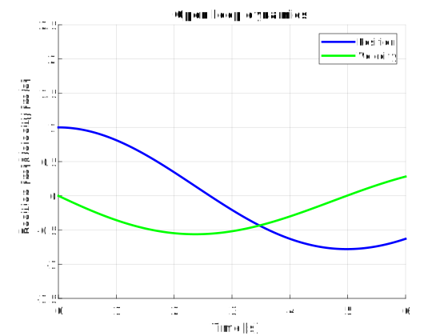
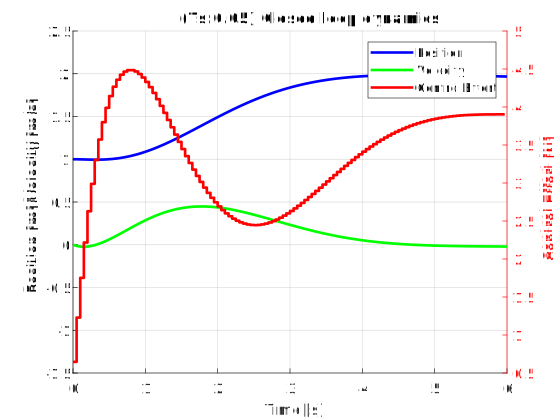
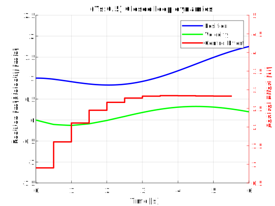
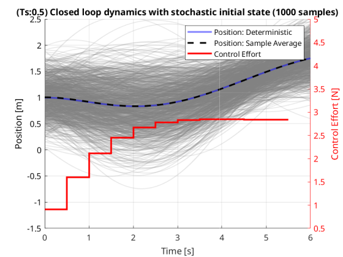

# Multi-fidelity Stochastic Trajectory Optimization

## Overview

- Given the state space equations of a system, we can predict how it evolves over time with a given control input.
- Since we can predict the future states of the system, we can optimize the control inputs over time to make sure the system gets to a desired state (position and vecocity = 0 in this case).
- We also do not want to use too much control effort to get to the desired state.
- Putting both of these ideas into maths, we can construct a cost function that is dependent on how far away the state is to the desired state and how much control effort is being used.
- This function can then be minimized over the control inputs to see which control inputs can get the system to the desired state with minimal effort.
- Now some things in the system might not be known exactly, like the initial state of the system or the spring constant of a mass spring damper system.
- These unknowns can be modeled as random variables, and the cost function then becomes a random variable itself, since it is now a function of other random variables.
- This cost function can be estimated using Monte Carlo with random samples from the distribution of the parameters, which would give us an expected value of the cost function.
- If we use fewer samples in the Monte Carlo, the estimate will be less accurate and will be away from the true expected value of the cost function more often and vice-versa.
- This means that if we were to repeat the Monte Carlo simulation multiple times with a fixed number of samples, it will have some variance in the estimate of the cost function.
- Our goal then becomes to minimize this variance in the Monte Carlo estimate of the cost function given a finite total computational cost, so that every time we run Monte Carlo, we are sure that it wont be too far off from the true value.
- Now normally we would just increase the number of samples in the Monte Carlo to reduce the variance till we hit our computational budget.
- But what if we had access to a lower fidelity model of the system that could give us a rough estimate (maybe it has some bias in either the cost or the solution of control inputs) of the cost function with lower computational cost? This means we can run more samples in the lower fidelity model for the same computational cost!
- With this in mind, our goal of minimizing the variance in the Monte Carlo estimate of the cost function is now not just about maxxing out the number of samples, but finding a good balance between the the number of samples we run in the high and low fidelity models given a fixed total computational budget that minimizes the variance.
- If we have multiple fidelity models, we will have to determine how to distribute the samples among the models.
- So to summarize
  - We have a system, whose trajectory we want to optimize using a cost function
  - Some parameters in the system are random, so the cost function is also random
  - To get an expectation of the cost function, we use Monte Carlo using random samples of the random parameters
  - If we have a low fidelity model as well, we can run a lot of samples in that model or run a few samples in the high fidelity model.
  - We want the Monte Carlo estimate to be close to the true value of the cost function, so we want to minimize its run-to-run variance.
  - Hence we try to distribute the samples among the models for a single run of the Monte Carlo so its variance is minimized.

## Dynamics

We have a simple mass spring damper system:

- Mass: m (chosen as 5)
- Spring constant: k (chosen as 2)
- Damping coefficient: b (chosen as 0.5)
- External force: F
- Displacement: x
- Velocity: v = $\dot{x}$
- Acceleration: a = $\ddot{x}$
- Force on Mass = $ma = m\ddot{x}$

Hence we have the equality

$$
\begin{aligned}
m\ddot{x} &= F - b\dot{x} - kx \\
\implies \ddot{x} &= \frac{F}{m} - \frac{b}{m}\dot{x} - \frac{k}{m}x
\end{aligned}
$$

Let the state of the dynamics be $[x, \dot{x}]$ where the control input $u=F$. We just observe the position $x$. Hence we have the state space equations

$$
\begin{aligned}
\begin{bmatrix}
\dot{x} \\
\ddot{x}
\end{bmatrix} &= \begin{bmatrix}
0 & 1 \\
-\frac{k}{m} & -\frac{b}{m}
\end{bmatrix} \begin{bmatrix}
x \\
\dot{x}
\end{bmatrix} + \begin{bmatrix}
0 \\
\frac{1}{m}
\end{bmatrix} u \\
y &=
\begin{bmatrix}
1 & 0
\end{bmatrix} \begin{bmatrix}
x \\
\dot{x}
\end{bmatrix}
\end{aligned}
$$

Thus, we have a linear system in the form $\dot{x} = Ax + Bu$ and $y = Cx$. Where

$$
\begin{aligned}
A &= \begin{bmatrix}
0 & 1 \\
-\frac{k}{m} & -\frac{b}{m}
\end{bmatrix} \\
B &= \begin{bmatrix}
0 \\
\frac{1}{m}
\end{bmatrix} \\
C &= \begin{bmatrix}
1 & 0
\end{bmatrix}
\end{aligned}
$$

This linear system will be converted to discrete time using MATLAB to give us the form $x_{k+1} = A x_k + B u_k$ and $y_k = C x_k$ for a chosen sampling time $T_s$.

## Deterministic LQR

To solve the LQR problem, we need to define the cost function to be minimzed. This is defined as

$$
\min_{u_0, u_1 ... u_{N-1}}J = x_N^T P x_N + \sum_{k=0}^{N-1} (x_k^T Q x_k + u_k^T R u_k)
$$

Where:

- $u_, u_1 ... u_{N-1}$ are the control inputs at each timestep of the trajectory
- $J$ is the total cost to be minimized
- $N$ is the time horizon
- $x_k$ is the state vector at time step $k$
- $u_k$ is the control input vector at time step $k$
- $Q$ is the state cost matrix
- $R$ is the control cost matrix
- $P$ is the terminal cost matrix

Stacking the state and control input vectors, we have

$$
\begin{aligned}
X &= \begin{bmatrix}
x_1 \\
x_2 \\
\vdots \\
x_N
\end{bmatrix} \text{with size } N n_x \times 1 \\
U &= \begin{bmatrix}
u_0 \\
u_1 \\
\vdots \\
u_{N-1}
\end{bmatrix} \text{with size } N n_u \times 1
\end{aligned}
$$

State transition formula for a linear system is $x_{k+1} = A x_k + B u_k$. Hence, starting from $x_0$, we can write the state vector at any time step as

$$
\begin{aligned}
x_1 &= A x_0 + B u_0 \\
x_2 &= A x_1 + B u_1 = A(A x_0 + B u_0) + B u_1 = A^2 x_0 + A B u_0 + B u_1 \\
\vdots \\
x_N &= A x_{N-1} + B u_{N-1} = A^{N-1} x_0 + A^{N-2} B u_0 + A^{N-3} B u_1 + \ldots + B u_{N-1} \\
\implies x_k &= A^k x_0 + \sum_{i=0}^{k-1} A^{k-1-i} B u_i
\end{aligned}
$$

Using this formula, we can construct matrices $S$ and $M$ such that $X = S U + M x_0$. The matrices $S$ and $M$ are given by

$$
\begin{aligned}
S &= \begin{bmatrix}
B & 0 & \ldots & 0 \\
AB & B & \ldots & 0 \\
\vdots & \vdots & \ddots & \vdots \\
A^{N-1} B & A^{N-2} B & \ldots & B
\end{bmatrix} \text{with size } Nn_x \times Nn_u \\
M &= \begin{bmatrix}
A \\
A^2 \\
\vdots \\
A^N
\end{bmatrix} \text{with size } Nn_x \times n_x
\end{aligned}
$$

The cost matrices can be stacked in a similar way to get $\bar{Q}$ and $\bar{R}$

$$
\begin{aligned}
\bar{Q} &= \begin{bmatrix}
Q & 0 & \ldots & 0 \\
0 & Q & \ldots & 0 \\
\vdots & \vdots & \ddots & \vdots \\
0 & 0 & \ldots & P
\end{bmatrix} \text{with size } Nn_x \times Nn_x \\
\bar{R} &= \begin{bmatrix}
R & 0 & \ldots & 0 \\
0 & R & \ldots & 0 \\
\vdots & \vdots & \ddots & \vdots \\
0 & 0 & \ldots & R
\end{bmatrix} \text{with size } Nn_u \times Nn_u
\end{aligned}
$$

The cost function in terms of the new matrices $X$, $U$, $S$, $M$, $\bar{Q}$ and $\bar{R}$ is

$$
\begin{aligned}
J &= x_N^T P x_N + \sum_{k=0}^{N-1} (x_k^T Q x_k + u_k^T R u_k) \\
&= X^T \bar{Q} X + U^T \bar{R} U + x_0^T Q x_0 \text{ (extra $x_0$ term because it is not in $X$)} \\
&= (S U + M x_0)^T \bar{Q} (S U + M x_0) + U^T \bar{R} U + x_0^T Q x_0 \\
% & \text{note } (A + B)^T = A^T + B^T \text{ and } (AB)^T = B^T A^T \\
&= (U^T S^T + x_0^T M^T) \bar{Q} (S U + M x_0) + U^T \bar{R} U + x_0^T Q x_0 \\
% & \text{note } A(B + C) = AB + AC \\
&= (U^T S^T + x_0^T M^T) (\bar{Q} S U + \bar{Q} M x_0) + U^T \bar{R} U + x_0^T Q x_0 \\
&= U^T S^T \bar{Q} S U + U^T S^T \bar{Q} M x_0 + x_0^T M^T \bar{Q} S U + x_0^T M^T \bar{Q} M x_0 + U^T \bar{R} U + x_0^T Q x_0 \\
% & \text{note } \bar{Q} \text{ is symmetric so it doesnt need to be transposed} \\
&= U^T S^T \bar{Q} S U + (x_0^T M^T \bar{Q} S U)^T + x_0^T M^T \bar{Q} S U + x_0^T M^T \bar{Q} M x_0 + U^T \bar{R} U + x_0^T Q x_0 \\
% & \text{note } x_0^T M^T \bar{Q} S U \text{ is a scalar(check its dimensions), so its transpose is itself} \\
&= U^T S^T \bar{Q} S U + x_0^T M^T \bar{Q} S U + x_0^T M^T \bar{Q} S U + x_0^T M^T \bar{Q} M x_0 + U^T \bar{R} U + x_0^T Q x_0 \\
% & \text{combining all quadratic and repeated terms} \\
&= U^T (S^T \bar{Q} S + \bar{R}) U + 2 x_0^T M^T \bar{Q} S U + x_0^T(M^T \bar{Q} M + Q) x_0\\
\end{aligned}
$$

Let

$$
\begin{aligned}
H &= S^T \bar{Q} S + \bar{R} = H^T \\
&\text{(quadratic multiplication by diagnonal($\bar{Q}$) results in a symmetric, R is symmetric)} \\
q &= (x_0^T M^T \bar{Q} S)^T = S^T \bar{Q} M x_0 \\
c &= x_0^T (M^T \bar{Q} M + Q) x_0
\end{aligned}
$$

The cost function can now be written as a quadratic function of the control inputs $U$

$$
J = U^T H U + 2 q^T U + c
$$

Which has a gradient with respect to $U$ as

$$
\Delta J = 2 H U + 2 q
$$

Assuming minimum exists, we can set the gradient to zero to get the optimal control input $U^*$

$$
\begin{aligned}
\Delta J &= 2 H U + 2 q = 0 \\
\implies U^* &= -H^{-1} q
\end{aligned}
$$

## Stochastic LQR

We will consider the case where the initial state $x_0$ is stochastic, with mean $\mu$ and covariance $\Sigma$.
The control input vector $U$ is still deterministic.

In this case, the state vector $X$ is stochastic, owing to the the initial condition $x_0$ being a vector of random variables. The state propagation equations are now expectations

$$
\begin{aligned}
E[x_1] &= E[A x_0 + B u_0] = A E[x_0] + B u_0 \\
E[x_2] &= E[A x_1 + B u_1] = A E[x_1] + B u_1 = A^2 E[x_0] + A B u_0 + B u_1 \\
\vdots \\
E[x_N] &= E[A x_{N-1} + B u_{N-1}] = A E[x_{N-1}] + B u_{N-1} \\
 &= A^N E[x_0] + A^{N-1} B u_0 + A^{N-2} B u_1 + \ldots + B u_{N-1} \\
\end{aligned}
$$

The matrices $S$ and $M$ remain the same, and we have the following expression for the expectation of the state vector $X$

$$
E[X] = S U + M E[x_0]
$$

The cost matrices $\bar{Q}$ and $\bar{R}$ are also the same. The cost function is now the expected value of the cost function over all possible realizations of the initial conditions. The cost function is

$$
\begin{aligned}
E[J] &= E[x_N^T P x_N + \sum_{k=0}^{N-1} (x_k^T Q x_k + u_k^T R u_k)] \\
&= E[X^T \bar{Q} X + U^T \bar{R} U + x_0^T Q x_0] \\
&= E[X^T \bar{Q} X] + E[U^T \bar{R} U] + E[x_0^T Q x_0] \\
&= E[(S U + M x_0)^T \bar{Q} (S U + M x_0)] + U^T \bar{R} U + E[x_0^T Q x_0] \\
% & \text{quadratic form: https://en.wikipedia.org/wiki/Quadratic_form_(statistics)} \\
&= E[U^T S^T \bar{Q} S U + U^T S^T \bar{Q} M x_0 + x_0^T M^T \bar{Q} S U + x_0^T M^T \bar{Q} M x_0] + U^T \bar{R} U + E[x_0]^T Q E[x_0] + \text{tr}(Q \Sigma) \\
&= U^T S^T \bar{Q} S U + E[U^T S^T \bar{Q} M x_0] + E[x_0^T M^T \bar{Q} S U] + E[x_0^T M^T \bar{Q} M x_0] + U^T \bar{R} U + E[x_0]^T Q E[x_0] + \text{tr}(Q \Sigma) \\
&= U^T (S^T \bar{Q} S + \bar{R}) U + U^T S^T \bar{Q} M E[x_0] + E[x_0^T] M^T \bar{Q} S U + E[x_0^T M^T \bar{Q} M x_0] + E[x_0]^T Q E[x_0] + \text{tr}(Q \Sigma) \\
&= U^T (S^T \bar{Q} S + \bar{R}) U + E[x_0^T] M^T \bar{Q} S U + E[x_0^T] M^T \bar{Q} S U + E[x_0]^T M^T \bar{Q} M E[x_0] + \text{tr}(M^T \bar{Q} M \Sigma) + E[x_0]^T Q E[x_0] + \text{tr}(Q \Sigma) \\
&= U^T (S^T \bar{Q} S + \bar{R}) U + 2 E[x_0^T] M^T \bar{Q} S U + E[x_0]^T (M^T \bar{Q} M + Q) E[x_0] + \text{tr}(M^T \bar{Q} M \Sigma)  + \text{tr}(Q \Sigma) \\
\end{aligned}
$$

Now assuming $E[x_0]$ is calculated using a Monte Carlo estimator, we can write the cost function as

$$
\begin{aligned}
H &= S^T \bar{Q} S + \bar{R} = H^T \\
q &= (E[x_0]^T M^T \bar{Q} S)^T = S^T \bar{Q} M E[x_0] \\
c &= E[x_0]^T (M^T \bar{Q} M + Q) E[x_0] + \text{tr}(M^T \bar{Q} M \Sigma)  + \text{tr}(Q \Sigma)
\end{aligned}
$$

The cost function can now be written as a quadratic function of the control inputs $U$

$$
J = U^T H U + 2 q^T U + c
$$

Which has a gradient with respect to $U$ as

$$
\Delta J = 2 H U + 2 q
$$

Assuming minimum exists, we can set the gradient to zero to get the optimal control input $U^*$

$$
\begin{aligned}
\Delta J &= 2 H U + 2 q = 0 \\
\implies U^* &= -H^{-1} q
\end{aligned}
$$

Which proves that the optimal control input when the initial state is stochastic is the same as when the initial state is deterministic if that the mean of the stochastic initial state is the same as the deterministic initial state given enough samples.

To visualize this, we can optmize individual trajectories with randomly sampled initial conditions and plot the average trajectory. The average trajectory is the solution to the stochastic LQR problem.

Here we use a simple Monte Carlo estimator to estimate the expected value of the cost function over some realizations of the initial conditions. The variance of this cost function is varies with the number of samples used in the Monte Carlo estimator.

$$
\begin{aligned}
Var[\hat{J}] &= E[(\hat{J} - E[\hat{J}])^2] \\
&= E[(U^T H U + 2 q^T U + c - E[U^T H U + 2 q^T U + c])^2] \\
\end{aligned}
$$

